# Multiplayer Game Deployment Demo 

 ## Purpose
The demo section will walk you through deploying a Minecraft server to a single account within your AWS environment. Upon successful deployment, you can connect to this server to play the game if you have Minecraft: Java Edition installed on your computer. You will complete the demo section by cleaning up any services and files deployed to avoid ongoing charges. The entire demo will take 1-2 hours or longer depending on how long you play the game.

## Assumptions
You have access to an AWS account with the appropriate permissions to deploy the sample application. You have experience using an IDE to modify application code. You are familiar with git and basic commands to clone a repository, add and commit modified files on your development machine, and push updates to a code repository.


## Prerequisites
The sample code assumes the application is being deployed into the us-west-2 region; however, this is configurable within the code depending on your preferred region. You will need Administrator or sufficient access to any accounts referenced in the tutorial. Please see the following document for how to setup an IAM administrative user account:  [https://docs.aws.amazon.com/SetUp/latest/UserGuide/setup-createadminuser.html](https://docs.aws.amazon.com/SetUp/latest/UserGuide/setup-createadminuser.html)

The following are prerequisites for your development machine:
-	Install and configure the AWS CLI version 2 [https://docs.aws.amazon.com/cli/latest/userguide/getting-started-install.html] (https://docs.aws.amazon.com/cli/latest/userguide/getting-started-install.html)
-	Install and configure Git 2.41.0 or greater [https://git-scm.com/downloads](https://git-scm.com/downloads)
-	Install Node.js 18.16.0 LTS or later [https://nodejs.org/en](https://nodejs.org/en)
-	Install Typescript version 5 or greater [https://www.typescriptlang.org/id/download](https://www.typescriptlang.org/id/download)
-	Install the CDK version 2.85 or greater [https://docs.aws.amazon.com/cdk/v2/guide/getting_started.html](https://docs.aws.amazon.com/cdk/v2/guide/getting_started.html)
-	Install the Minecraft Launcher if you want to test the game (may require a license): [https://www.minecraft.net/en-us/download](https://www.minecraft.net/en-us/download)

## Preparing the sample code
Create an AWS CodeCommit repository named: cdk-container-sample

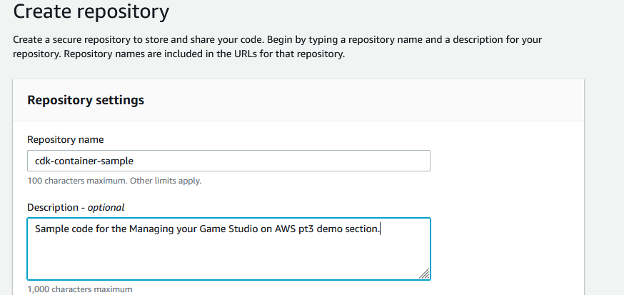

Download the sample code from the <mark>[need repo location and link to download the code]()</mark>

Upload the sample code to your cdk-container-sample repository in AWS CodeCommit.
Please see the AWS CodeCommit repository document for creating a repository and adding files: [https://docs.aws.amazon.com/codecommit/latest/userguide/how-to-create-repository.html](https://docs.aws.amazon.com/codecommit/latest/userguide/how-to-create-repository.html) 

Once you have cloned the repository from AWS CodeCommit to your development machine, open the sample code in your favorite IDE.

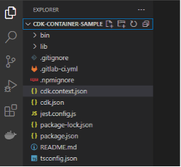

## Deploying the sample code
Update a few values in the sample code before deploying.

Open the cdk.context.json file and update the 3 values based on your environment:
-	default_repo_branch_name – The name of your AWS CodeCommit repository branch
-	dev_account_id – The AWS account ID where you want to deploy the game server
-	deployment_region – The AWS region where you want to deploy the game server
    - If you change the region from us-west-2 you will also need to update the region in the bin/game-demo-pipeline.ts file and change the region in command line parameters in later steps

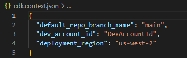

The main code that creates the code pipeline for deployment is lib/game-demo-pipeline-stack.ts
Comments are included in the code that describe each step and additional options for deploying to multiple accounts.

The security group for accessing the game is open to any IP to allow friends to join if desired. You can lock this down to specific IPs by modifying the security group after the resources are created.

Save your changes and run the following commands in a terminal to begin building the application:

- Install dependencies:
```
npm install
```

- Run the build:
```
npm run build
```

Now ‘bootstrap’ the account to give the CDK permission to deploy resources to the account. The following command will bootstrap the account and provide the execution policy for an Administrator role to execute the initial deployment.

- Run CDK bootstrap on <b><i style="color:red">DevAccount1</i></b> which should be the same account you put in the cdk.context.json dev_account_id field. Ensure that you are using an Administrative User that has access to the account, replace <DevAccount1> below with the respective account ID and update the region if you choose something other than us-west-2:

```
npx cdk bootstrap aws://<DevAccount1>/us-west-2 --cloudformation-execution-policies "arn:aws:iam::aws:policy/AdministratorAccess"
```
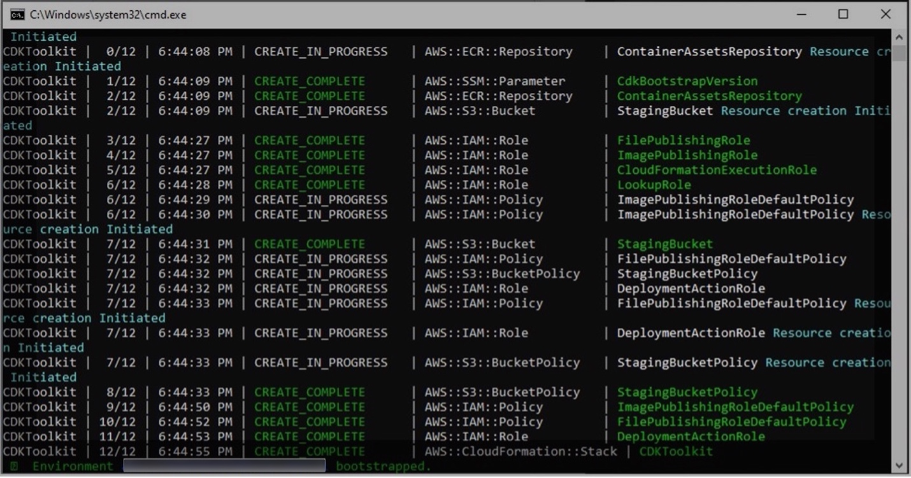

Save all changes to the code files and push the updated code to your AWS CodeCommit repository (This is done after bootstrapping because that process modifies the cdk.context.json file):

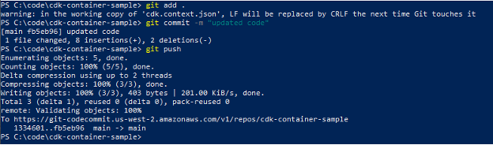

Now provision the CodePipeline to deploy the application in your account. 

```
npx cdk deploy GameDemoPipelineStack
```

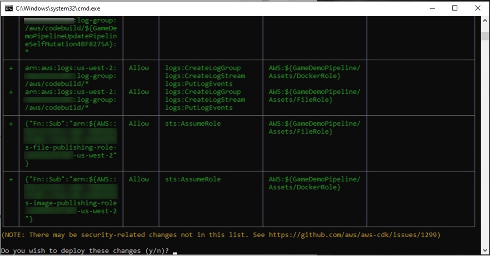

In the command above, <b><i>“GameDemoPipelineStack”</i></b> is the stack that is created by the CDK, and it will deploy the CodePipeline to <b><i style="color:red">DevAccount1</i></b> using CloudFormation. Once the CodePipeline deploys successfully, it will begin to run. 

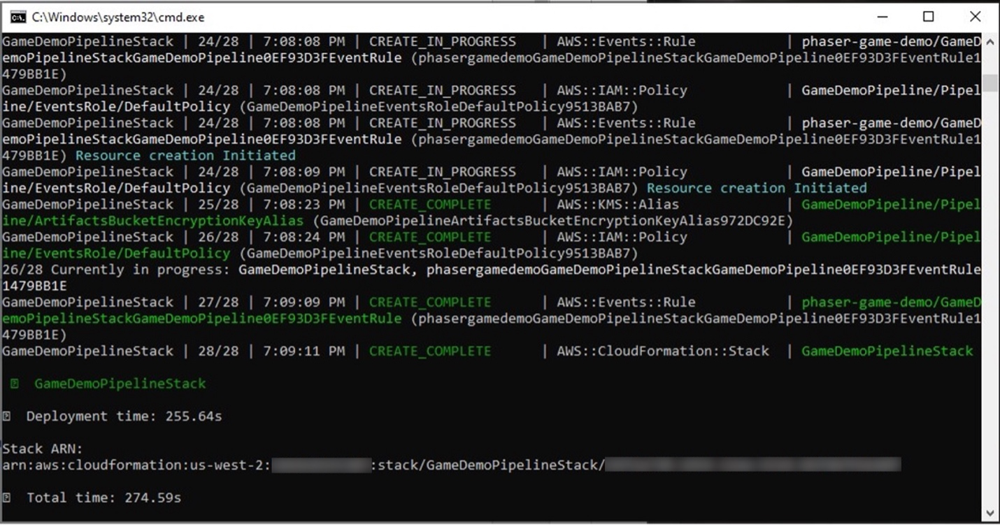

### AWS CodePipeline Console
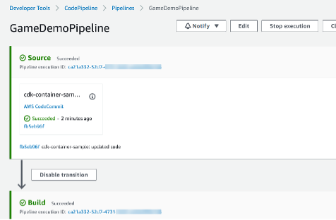

### AWS CloudFormation
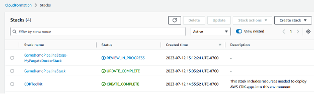

Once the CloudFormation stack GameDemoPipelineStage-MyFargateDockerStack shows UPDATE_COMPLETE, your game server is running. Go to the AWS ECS console and click on the GameDemoPipelineStage-xxx cluster.

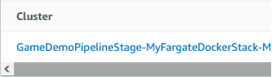

Click on the Tasks tab and click the Task Id:

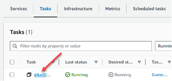

Click on the Network bindings tab to see the IP and Port listed under the External link column:

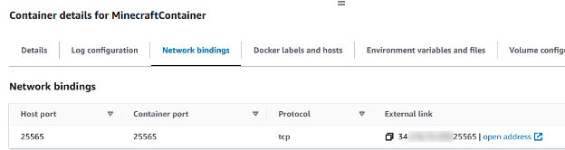


You can now connect to this server using your Minecraft (Java) [client](https://www.minecraft.net/en-us/download):

From the Minecraft Java Client, click on Multiplayer.
Click Add Server and paste in the IP and Port copied from the External link field into the Server Address:

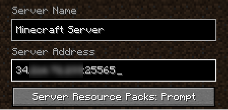

Click done, select your server, and click Join Server to begin playing.

Enjoy playing the game and invite up to 9 friends to join you.

## Cleaning up your environment
When you are done playing the game, you want to cleanup all of the artifacts that were deployed into your environment during this demo to avoid continued charges.

Go to the AWS Console and navigate to CloudFormation.

Choose the GameDemoPipelineStage-MyFargateDockerStack and click the Delete button.

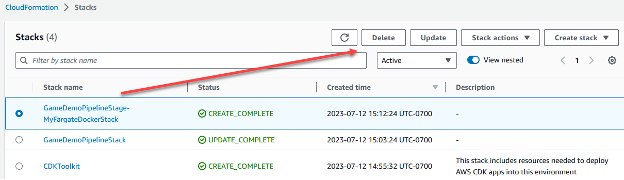

Once deleted, repeat the process for the GameDemoPipelineStack and the CDKToolkit.

If you encounter a DELETE_FAILED on one of the stacks, choose to delete it again and it will show you the resource that it couldn’t delete and give you a link where you can delete it manually:

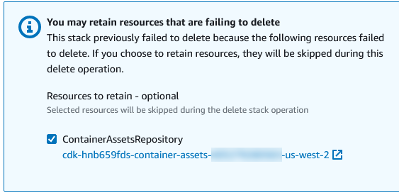

For completeness, check for any S3 buckets that may not have been deleted:
-	cdk\-\*
-	gamedemopipelinestack\*


The last piece to cleanup is the CodeCommit repository with the sample code:

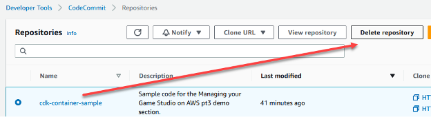

We hope you enjoyed working through this demo process.
